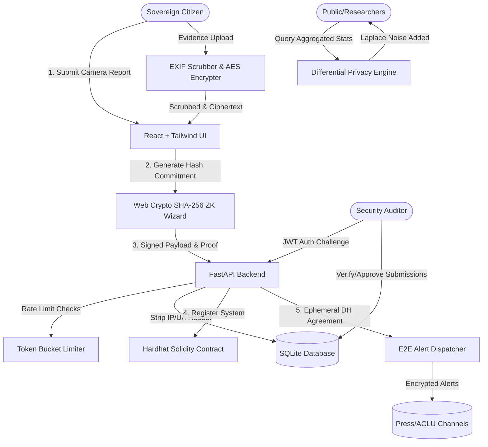

# WatchTheWatchers 👁️🛡️

> **"If they're watching you, you're watching them back."**

WatchTheWatchers is an interactive transparency and accountability platform that flips the mass surveillance dynamic. Rather than governments monitoring citizens, citizens track, audit, and expose the surveillance apparatus being deployed against the public. Every facial recognition camera, license plate reader (ALPR), and IMSI catcher (Stingray) is logged, threat-scored, and committed to an immutable ledger.

---

## 🏗️ Architecture & Data Flow



---

## 🛠️ Technology Stack

- **Frontend**: React (Vite) + Tailwind CSS v4 + Framer Motion + Lucide Icons
- **Backend API**: Python FastAPI + SQLAlchemy + SQLite (PostgreSQL compatible)
- **Privacy Engine**: Web Crypto API (SHA-256 commitment) + Client-side AES-256-GCM + NumPy (Laplace Noise Differential Privacy)
- **Smart Contracts**: Solidity + Hardhat + ethers.js

---

## ⚡ Quick Start (Local Run)

### Prerequisites
- Node.js (v18+)
- Python (v3.10+)

### 1. Start the FastAPI Backend
```bash
cd backend
python3 -m venv venv
source venv/bin/activate  # On Windows: venv\Scripts\activate
pip install -r requirements.txt
uvicorn app.main:app --reload --port 8000
```
*The database will auto-seed with mock cameras and audit logs on first boot.*

### 2. Start the React Frontend
```bash
cd frontend
npm install
npm run dev
```
*Open [http://localhost:5173](http://localhost:5173) in your browser.*

### 3. Run Smart Contracts (Optional)
```bash
cd contracts
npm install
npx hardhat compile
npx hardhat test
```

---

## 🐳 Running with Docker (Hot Reloading Enabled)

To launch the entire stack in containers with hot-reloading enabled for development:
```bash
docker-compose up --build
```
- Frontend: `http://localhost:5173`
- Backend API: `http://localhost:8000`
- API Docs: `http://localhost:8000/docs`

---

## 🧪 Running Automated Tests

To run the custom token-bucket rate limiter verification suite:
```bash
cd backend
pytest tests/test_limiter.py -v
```

---

## 🎤 5-Slide Pitch Deck Structure

### 🌌 Slide 1: The Invisible Panopticon (The Problem)
- **Visual**: High-contrast graphic of a CCTV camera overlayed with biometric facial scanning boxes.
- **Copy**: Mass surveillance has quietly scaled. AI facial recognition, IMSI catchers, and ALPR cameras track our movements, associations, and metadata without consent, oversight, or transparency.
- **Hook**: *Who watches the watchers?*

### 👁️ Slide 2: WatchTheWatchers (The Solution)
- **Visual**: Cyberpunk dashboard showing a city map populated with camera markers and a rolling data access feed.
- **Copy**: Flipping the surveillance dynamic. A citizen-run platform to map, score, and challenge state and corporate surveillance devices.
- **Core Value**: Radical transparency, immutable records, and absolute whistleblower protection.

### 🔒 Slide 3: The Privacy Stack (Technical Innovation)
- **Visual**: Block diagram detailing the three layers: Zero-Knowledge commitments, local metadata scrubbing, and differential privacy.
- **Copy**:
  - **Zero-Knowledge Proofs**: Prove local citizenship to bypass spam filters without exposing your legal identity.
  - **Laplace Differential Privacy**: Add noise to neighborhood statistics to reveal trends without leaking precise device coordinates.
  - **EXIF Purge & E2EE Alert Dispatch**: Client-side metadata stripping + Ephemeral Diffie-Hellman alerts dispatched to the press.

### 🚀 Slide 4: Decentralized Trust & Smart Governance
- **Visual**: A mock transaction showing a camera registration logged on the blockchain ledger.
- **Copy**: Smart contracts on Ethereum keep records permanently public. No government agency or private corporation can request data deletion, modify threat scores, or purge reports. Community members flag and verify sensors through on-chain audits.

### 🔮 Slide 5: The Freedom Grid (The Vision)
- **Visual**: A bright, neon-purple network map spanning across a clean, green, citizen-governed city.
- **Copy**: Restoring the balance between public safety and civil liberties. WatchTheWatchers scales globally, empowering citizens, legal networks, and investigative journalists with actionable, un-censorable data.
- **Tagline**: *If they're watching you, you're watching them back.*
